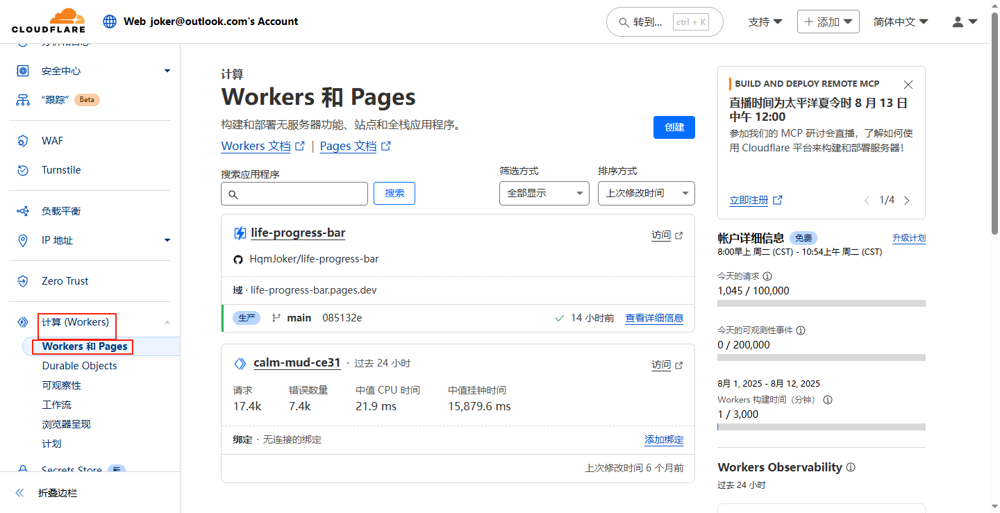
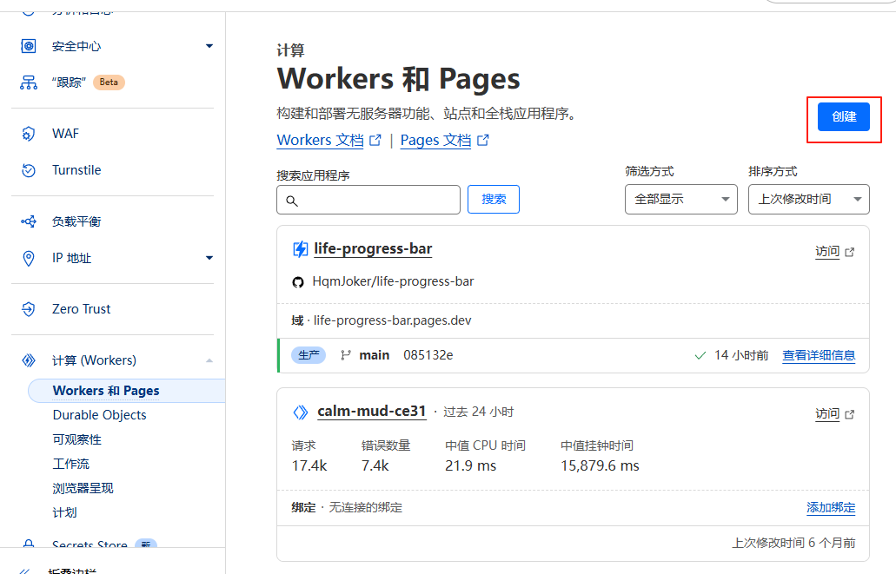

# Cloudflare Pages 静态网站部署教程（适合小白用户）

## 前言
本教程适合没有任何部署经验的小白用户，帮助你从零开始，把一个纯前端静态网站部署到 Cloudflare Pages，让全球用户（包括中国大陆）都能稳定访问。

---

## 一、准备工作
在开始之前，请确保你已经具备以下条件：
1. 一个 Cloudflare 账号（[注册](https://dash.cloudflare.com/sign-up)）
2. 一个 GitHub 账号（[注册](https://github.com/join)）
3. 一个静态网站项目（比如包含 `index.html`、`style.css`、`script.js`）

---

## 二、上传项目到 GitHub
1. 登录 GitHub，点击 **New** 新建仓库
2. 填写仓库名称（Repository name），选择 **Public**（公开）
3. 创建完成后，将本地静态文件上传到该仓库（直接拖拽到网页也行）
4. 确保仓库根目录下能看到 `index.html`

---

## 三、Cloudflare Pages 创建项目

1. 登录 Cloudflare 控制台，在左侧菜单找到 **Pages**
   
   

2. 点击 **创建项目**  
   
   

3. 选择 **连接到 Git**，选择你的 GitHub 仓库，并授权 Cloudflare 访问

4. 进入 **构建设置** 页面：
   - 框架预设：选择 **无**
   - 构建命令：`echo "no build"`
   - 构建输出目录：`/`
   
5. 点击 **保存并部署**，等待几分钟即可看到部署成功页面，Cloudflare 会给你一个测试域名，例如：
   ```
   https://yourproject.pages.dev
   ```

---

## 四、绑定自己的域名（可选）
1. 在 Cloudflare 主页添加你的域名
2. 在 Pages 项目中，进入 **自定义域** 设置
3. 输入你的域名并保存
4. 按提示在 DNS 中添加 CNAME 记录

---

## 五、常见问题

### 1. 部署后页面显示“hello world”
这是因为构建目录或命令不对，检查：
- 构建命令必须是：`echo "no build"`
- 构建输出目录必须是 `/`
- 确保 `index.html` 在仓库根目录

### 2. 中国大陆无法访问
- Cloudflare Pages 默认支持全球 CDN，一般无需额外配置
- 如果访问慢，可考虑启用 **Cloudflare Workers** 做加速

### 3. 如何更新网站内容？
只需更新 GitHub 仓库代码并提交，Cloudflare 会自动触发部署。

---

## 六、总结
通过 Cloudflare Pages + GitHub，你可以免费、快速地部署一个支持全球访问的静态网站，无需服务器，无需备案，适合个人博客、项目展示等场景。

